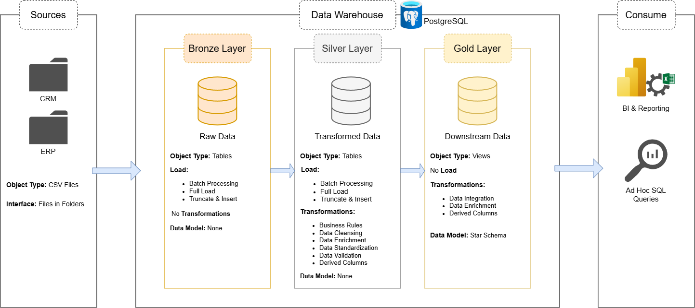
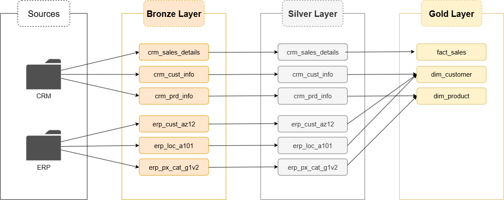
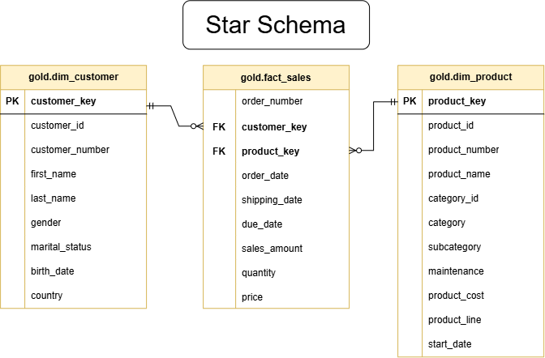

# Sales Data Warehouse & Analytics Project

An end-to-end Data Warehouse and Business Intelligence project built using the Medallion Architecture. This project demonstrates the complete data engineering workflow—from ingesting raw CSV files into PostgreSQL, transforming and validating data through Bronze and Silver layers, creating an analytical Gold layer using a star schema, and visualizing business insights with Power BI.

---

## Requirements
- PostgreSQL 18+
- Power BI Desktop
- Python 3.12+
- pgAdmin 4
- Required Python packages:
  - pandas
  - SQLAlchemy
  - psycopg2-binary
  - python-dotenv

---

## Project Overview

This project implements a modern data warehouse using PostgreSQL and follows the Medallion Architecture:

- **Bronze Layer** – Raw data ingestion from CSV files
- **Silver Layer** – Data cleansing, validation, and business transformations
- **Gold Layer** – Business-ready dimensional model for analytics
- **Power BI** – Interactive dashboard for business reporting

The project focuses on building a scalable, maintainable ETL pipeline while ensuring high data quality and delivering meaningful business insights.

---

## Tech Stack

| Technology | Purpose |
|------------|---------|
| PostgreSQL | Data Warehouse |
| Python | ETL Automation |
| Pandas | Data Processing |
| SQLAlchemy | Database Connection |
| Power BI | Data Visualization |
| Draw.io | Architecture & Data Modeling |
| Git & GitHub | Version Control |

---

# Project Architecture

## Data Architecture



---

## Data Flow



---

## ETL Pipeline

docs/etl_pipeline.png

---

## Data Model (Star Schema)



---

# Medallion Architecture

## Bronze Layer

Purpose:

- Store raw source data
- Preserve original records
- No business transformations

Data Sources:

- CRM Customer Information
- CRM Product Information
- CRM Sales Details
- ERP Customer Information
- ERP Location Information
- ERP Product Categories

---

## Silver Layer

Purpose:

Clean and standardize data before business modeling.

### Transformations

- Removed duplicate customer records
- Trimmed unnecessary whitespace
- Standardized gender values
- Standardized marital status values
- Standardized country names
- Extracted product category identifiers
- Split product keys
- Replaced NULL product costs
- Corrected invalid sales values
- Corrected invalid dates
- Standardized customer IDs
- Generated product validity periods

### Business Rules

- Keep latest customer record
- Sales = Quantity × Price
- Remove impossible birth dates
- Convert unknown values to "n/a"
- Prevent overlapping product validity periods

---

## Gold Layer

Purpose:

Provide business-ready analytical views using a Star Schema.

### Dimension Tables

- dim_customers
- dim_products

### Fact Table

- fact_sales

---

# Data Quality Checks

The following validation checks were performed after data transformation.

### Bronze → Silver

- Duplicate customer removal
- Invalid date detection
- NULL value validation
- Product cost validation
- Sales calculation validation
- Country standardization
- Gender standardization
- Marital status standardization

### Gold Layer

- Duplicate Customer Keys
- Duplicate Product Keys
- Referential Integrity
- Fact-Dimension Relationship Validation
- Primary Key Validation

---

# Power BI Dashboard

The dashboard consists of four pages.

---

## 1. Executive Summary

Displays overall business performance.

KPIs

- Total Sales
- Total Customers
- Total Products
- Total Orders

Visuals

- Sales Trend
- Sales by Category
- Sales by Country
- Top Customers

---

## 2. Customer Analysis

Analyzes customer demographics and purchasing behavior.

Visuals

- Customer Distribution
- Sales by Gender
- Sales by Country
- Top Customers

---

## 3. Product Analysis

Analyzes product performance.

Visuals

- Sales by Category
- Sales by Product Line
- Top Products
- Product Distribution

---

# Repository Structure

```text
Sales-Data-Warehouse/
│
├── powerbi/
│   ├── Sales_Data_Warehouse.pbix
│   └── screenshots/
│       
│
├── datasets/
│
├── scripts/
│   ├── bronze/
│   ├── silver/
│   └── gold/
│
├── docs/
│   ├── data_architecture.png
│   ├── data_flow.png
│   ├── etl_pipeline.png
│   └── data_model.png
│
├── .env.example
├── LICENSE
└── README.md
```

---

# Key Features

- Medallion Architecture
- PostgreSQL Data Warehouse
- Automated ETL using Python
- Data Quality Validation
- Star Schema Modeling
- Business Rule Implementation
- Power BI Dashboard
- Modular SQL Scripts

---

# Future Improvements

- Incremental ETL Loading
- Slowly Changing Dimensions (SCD Type 2)
- Automated ETL Scheduling
- CI/CD Pipeline
- Data Catalog
- Unit Testing for ETL
- Cloud Deployment (Azure/AWS)

---

# Dashboard Preview

### Executive Summary

![Executive Summary]

---

### Customer Analysis

![Customer Analysis]

---

### Product Analysis

![Product Analysis]

---

# Author

**Darryl Rian Ancheta**

Bachelor of Science in Computer Science
